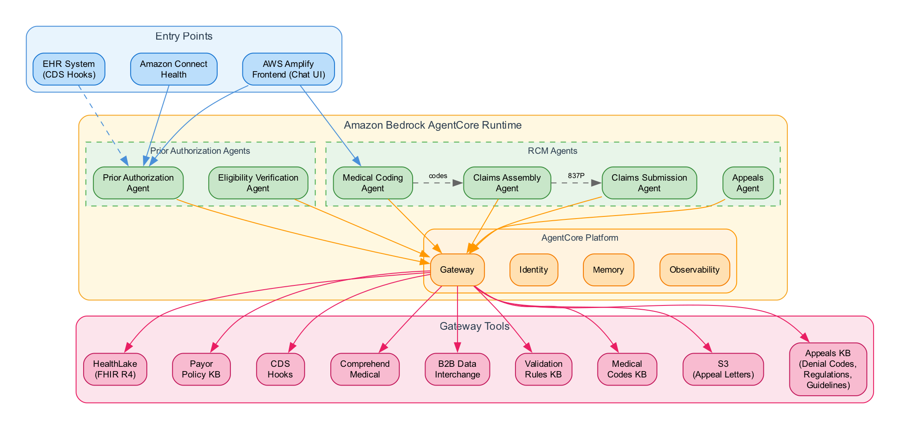

# Healthcare Prior Authorization Agents on Amazon Bedrock AgentCore

This repository contains healthcare-focused AI agents for **prior authorization** and **revenue cycle management** built using the Strands SDK on Amazon Bedrock AgentCore.

**Based on the [Fullstack Solution Template for AgentCore (FAST)](https://github.com/awslabs/fullstack-solution-template-for-agentcore).** For detailed instructions on getting started, deployment, and configuration, refer to the [FAST repository documentation](https://github.com/awslabs/fullstack-solution-template-for-agentcore).

## Reference Guides

This codebase implements patterns described in these AWS blog posts:
- [Transform healthcare prior authorization with AI agents](https://aws.amazon.com/blogs/industries/transform-healthcare-prior-authorization-with-ai-agents/)
- [Transform healthcare revenue cycle management with Amazon Bedrock AgentCore](https://aws.amazon.com/blogs/industries/transform-healthcare-revenue-cycle-management-with-amazon-bedrock-agentcore/)

### Amazon Connect Health

[Amazon Connect Health](https://aws.amazon.com/about-aws/whats-new/2026/03/amazon-connect-health-agentic-ai-healthcare/) provides managed agentic AI capabilities at the point of care, including ambient documentation, patient insights, and medical coding. The [Amazon Connect Health Point-of-Care Demo](https://github.com/aws-samples/sample-amazon-connect-health-point-of-care) showcases these capabilities in a full-stack EHR interface. Customers can use Connect Health's managed agents as an alternative to the self-managed implementations in this repository — see the [blog post](https://aws.amazon.com/blogs/industries/how-amazon-connect-health-brings-agentic-ai-to-the-point-of-care/) for details on how these capabilities compose in a clinical workflow.

## Agent Catalog and Architecture



### Prior Authorization Agent

The `prior-authorization-agent` pattern automates the prior authorization workflow:

- **Clinical Data Gathering**: Retrieves patient conditions, medications, observations, and allergies from HealthLake via AgentCore Gateway
- **Payor Policy Lookup**: Searches uploaded payor policy documents to find coverage criteria, medical necessity requirements, and documentation needs for specific procedures
- **Prior Auth Requirement Check**: Determines if a procedure requires prior authorization based on CPT/HCPCS code and payor-specific rules
- **Medical Necessity Assessment**: Evaluates whether the clinical evidence meets the payor's medical necessity criteria
- **Authorization Request Assembly**: Compiles clinical documentation, diagnosis codes (ICD-10), and procedure codes (CPT/HCPCS) into a complete authorization request per payor requirements
- **CDS Hooks Integration**: Can be triggered automatically from EHR systems via CDS Hooks (`patient-view` and `order-select` hooks) for seamless workflow integration

### Eligibility Verification Agent

The `eligibility-verification-agent` pattern verifies patient insurance eligibility:

- **Patient Identification**: Retrieves and verifies patient demographics from HealthLake
- **Coverage Verification**: Checks active insurance coverage, effective dates, plan details
- **Benefits Check**: Determines if requested services are covered benefits with any limitations
- **Cost Sharing Details**: Identifies copay, coinsurance, deductible status, and out-of-pocket estimates
- **Prior Auth Determination**: Determines if the requested service requires prior authorization

### Medical Coding Agent

The `medical-coding-agent` extracts and assigns standardized medical codes from clinical text. This agent is based on the [Guidance for Identifying Diagnosis Codes from Clinical Notes on AWS](https://aws.amazon.com/solutions/guidance/identifying-diagnosis-codes-from-clinical-notes-on-aws/).

> **Managed Alternative:** AWS also offers a managed medical coding agent as part of [Amazon Connect Health Agentic AI for Healthcare](https://aws.amazon.com/about-aws/whats-new/2026/03/amazon-connect-health-agentic-ai-healthcare/) (in preview as of April 2026). Customers can use that as an alternative to this self-managed implementation.

- **Entity Extraction**: Uses Amazon Comprehend Medical to identify medical conditions, medications, procedures, and anatomy from clinical notes
- **ICD-10-CM Lookup**: Searches the medical codes knowledge base for diagnosis codes
- **CPT Code Search**: Finds procedure codes matching clinical descriptions
- **SNOMED CT Mapping**: Maps clinical terms to SNOMED CT concepts for interoperability

### Claims Assembly Agent

The `claims-assembly-agent` validates and assembles EDI 837P professional claim structures:

- **EDI 837P Assembly**: Builds compliant claim structures from patient, provider, and service data
- **Payer Rule Validation**: Queries the validation rules knowledge base for payer-specific requirements
- **HIPAA Compliance Check**: Validates claims against HIPAA transaction standards
- **Schema Validation**: Ensures all required fields and formats meet EDI specifications

### Claims Submission Agent

The `claims-submission-agent` handles claim submission via AWS B2B Data Interchange:

- **EDI 837P Submission**: Submits assembled claims to payers through B2B Data Interchange
- **Submission Tracking**: Monitors transformation job status for submitted claims
- **997/999 Acknowledgments**: Retrieves functional and implementation acknowledgments from payers

### Appeals Agent

The `appeals-agent` generates appeal letters for denied claims:

- **Denial Analysis**: Reviews claim denial reasons and payer-specific rules via Gateway KB tools
- **Appeal Letter Generation**: Drafts compliant appeal letters with supporting clinical evidence
- **Letter Storage**: Saves finalized appeal letters to S3 with presigned download URLs

### Gateway Tools

#### HealthLake Tools (Shared — Patient Clinical Data)

| Tool | Description |
|------|-------------|
| `get_patient_conditions` | Patient diagnoses and conditions (ICD-10) |
| `get_patient_medications` | Current and historical medications |
| `get_patient_observations` | Lab results, vitals, clinical observations |
| `get_patient_allergies` | Allergy and intolerance records |
| `get_patient_appointments` | Scheduled and past appointments |
| `get_patient_everything` | Comprehensive patient data retrieval |
| `advanced_patient_search` | Search patients by demographics, conditions |

#### Payor Policy Tools (Prior Auth Rules Knowledge Base)

| Tool | Description |
|------|-------------|
| `search_payor_policies` | Semantic search across uploaded payor policy documents |
| `lookup_prior_auth_requirements` | Check if a CPT/HCPCS code requires prior auth for a payor |
| `upload_policy_document` | Upload payor policy documents (PDFs, guidelines) for indexing |
| `list_policy_documents` | List available payor policy documents |

#### CDS Hooks Tools (EHR Integration)

| Tool | Description |
|------|-------------|
| `get_cds_services` | CDS Hooks service discovery for EHR systems |
| `handle_patient_view` | Patient chart opened — returns condition alerts |
| `handle_order_select` | Order placed — determines if prior auth is required |

#### Comprehend Medical Tools (Medical Coding)

| Tool | Description |
|------|-------------|
| `extract_medical_entities` | Extract medical conditions, medications, procedures, and anatomy from clinical text |
| `detect_phi` | Detect Protected Health Information (PHI) in text |

#### B2B Data Interchange Tools (Claims Submission)

| Tool | Description |
|------|-------------|
| `submit_claim` | Submit EDI 837P claim JSON to B2B Data Interchange input bucket |
| `check_submission_status` | Query B2B transformation job status for a submitted claim |
| `retrieve_acknowledgments` | Retrieve 997/999 functional and implementation acknowledgments from S3 |
| `list_submissions` | Query submission history for tracking |

#### Validation Rules KB Tools (Claims Assembly)

| Tool | Description |
|------|-------------|
| `query_validation_rules` | Search payer-specific validation rules, HIPAA compliance rules, and EDI schema requirements |

#### Medical Codes KB Tools (Medical Coding)

| Tool | Description |
|------|-------------|
| `search_medical_codes` | Search for ICD-10-CM, CPT, and SNOMED CT codes by clinical description |

#### Appeals KB Tools (Appeals Agent)

| Tool | Description |
|------|-------------|
| `search_denial_codes` | Look up CARC/RARC denial reason codes with appeal strategies and required evidence |
| `search_appeal_regulations` | Find payer-specific appeal timelines, filing requirements, and escalation paths |
| `search_clinical_guidelines` | Find medical necessity criteria, clinical practice guidelines, and evidence requirements by procedure |

## Demo Walkthrough

Deploy the solution into your own AWS account using the [Quick Start](#quick-start) below. Once deployed, the Amplify-hosted frontend gives you your own URL to walk through the end-to-end RCM workflow:

1. **Patient Selection** — Choose a patient from the EHR-style landing page. The system loads their clinical record from HealthLake (FHIR R4).
2. **Eligibility Verification** — The Eligibility Verification Agent checks active insurance coverage, plan details, benefits, and cost sharing for the patient.
3. **Prior Authorization** — A clinician orders a procedure (e.g., MRI lumbar spine). The Prior Authorization Agent gathers clinical data (conditions, medications, observations), searches payor policies for coverage criteria, assesses medical necessity, and assembles a FHIR Claim bundle per Da Vinci PAS.
4. **Medical Coding** — The Medical Coding Agent extracts medical entities from clinical notes using Comprehend Medical, then searches the knowledge base for ICD-10-CM, CPT, and SNOMED CT codes.
5. **Claims Assembly** — The Claims Assembly Agent validates all claim data against HIPAA 5010 requirements (NPI, Tax ID, diagnosis codes, procedure codes, dates, charges) and assembles a compliant EDI 837P structure.
6. **Claims Submission** — The Claims Submission Agent submits the assembled claim via B2B Data Interchange and tracks 997/999 acknowledgments.
7. **Appeals** — If a claim is denied, the Appeals Agent checks filing deadlines, looks up denial codes (CARC/RARC) and appeal regulations, generates a validated appeal letter with clinical evidence, and saves it to S3.

Each agent streams its reasoning and tool calls in real time through the chat interface, showing which Gateway tools (HealthLake, Payor Policy KB, Comprehend Medical, B2B Data Interchange, etc.) are being invoked at each step.

## Quick Start

### Prerequisites

- AWS Account with Bedrock model access (Claude Sonnet)
- AWS CLI configured
- Node.js 20+ and npm
- Python 3.10+
- AWS CDK CLI (`npm install -g aws-cdk`)

### Deploy

```bash
# 1. Configure
cd infra-cdk
cp ../infra-cdk/config.yaml config.yaml
# Edit config.yaml with your HealthLake datastore ID

# 2. Install CDK dependencies
npm install

# 3. Deploy
cdk deploy --all
```

For detailed deployment instructions, see [docs/DEPLOYMENT.md](docs/DEPLOYMENT.md).

> **HealthLake datastore ID at deploy time.** Keep `config.yaml` sanitized
> (`YOUR_HEALTHLAKE_DATASTORE_ID`) and supply the real value as an environment
> override when deploying the backend so it never lands in source control:
>
> ```bash
> HEALTHLAKE_DATASTORE_ID=<your-datastore-id> \
>   cdk deploy healthcare-agents-stack --require-approval never
> ```

## Testing the Prior Authorization & Eligibility Flows

After deploying, grab the relevant endpoints from the CloudFormation stack
outputs (the names below match the CDK outputs):

```bash
# CDS Hooks REST endpoint (discovery + patient-view + order-select)
aws cloudformation describe-stacks \
  --stack-name healthcare-agents-stack \
  --query "Stacks[0].Outputs[?OutputKey=='CdsHooksApiUrl'].OutputValue" \
  --output text

# Amplify web app URL
aws cloudformation describe-stacks \
  --stack-name healthcare-agents-stack \
  --query "Stacks[0].Outputs[?OutputKey=='AmplifyUrl'].OutputValue" \
  --output text
```

The CDS Hooks **discovery** endpoint is `GET {CdsHooksApiUrl}cds-services`.

### 1. In-app prior authorization (Amplify UI)

1. Open the **AmplifyUrl** in your browser and sign in (Cognito hosted UI).
2. Go to **New Order**.
3. Paste a patient ID from your HealthLake datastore. The form calls
   `/patients?q=<id>` and auto-populates the patient name, payer, member ID,
   and active conditions from HealthLake (demographics + active `Coverage` +
   `Condition` resources).
4. Enter the procedure/drug code and submit. The order routes to the
   **prior-authorization wizard**, which invokes the Prior Authorization Agent.
5. The agent gathers clinical data, looks up payor policy via
   `lookup_prior_auth_requirements` (a model-assessed, per-medication
   determination — there is no hardcoded drug list), assesses medical
   necessity, and returns a recommendation with its reasoning streamed live.
6. Review the recommendation. The decision is **user-initiated** — click
   **Save Authorization** to persist a FHIR `ClaimResponse`/`Task` back to
   HealthLake via the authenticated `POST /authorizations` endpoint. Nothing is
   written automatically.

### 2. CDS Hooks flow (EHR-style launch)

This exercises the same agent from a CDS Hooks card, as an EHR would.

1. Open the [CDS Hooks Sandbox](https://sandbox.cds-hooks.org/) in an
   **incognito/private window** (avoids a cached patient context).
2. Configure the sandbox:
   - **Discovery endpoint**: the `CdsHooksApiUrl` output above.
   - **FHIR server**: a SMART R4 sandbox (e.g.
     `https://launch.smarthealthit.org/v/r4/fhir`) with your test patient
     loaded. SMART sandboxes reset periodically, so re-import the patient if
     the patient picker reappears.
   - **Patient**: select your test patient.
3. Place a medication/procedure order that requires prior authorization. The
   `order-select` hook fires and the agent-backed service returns a card.
4. Click **Submit Prior Authorization (AI agent)**. The card links into the
   **Amplify UI** prior-auth wizard with the patient ID, code, description, and
   payor pre-filled from the card context, then continues as in flow 1
   (review → **Save Authorization**).

### 3. Eligibility verification

1. In the Amplify UI, open **Eligibility**.
2. Enter (or paste) the patient ID — the `/patients?q=<id>` lookup
   auto-populates demographics and active coverage.
3. Submit to run the Eligibility Verification Agent, which checks active
   coverage, plan details, benefits, and cost sharing and streams its findings.

## Project Structure

```
├── frontend/                          # AWS Amplify React frontend
│   ├── src/
│   │   ├── app/                      # Next.js app router pages
│   │   ├── components/               # UI components (shadcn/ui)
│   │   │   ├── auth/                 # Authentication (OIDC)
│   │   │   ├── chat/                 # Chat interface
│   │   │   ├── landing/              # Landing page
│   │   │   └── ui/                   # shadcn/ui primitives
│   │   ├── hooks/                    # React hooks
│   │   ├── lib/                      # Auth config, utilities
│   │   └── services/                 # AgentCore API service
│   └── package.json
│
├── patterns/                          # Agent patterns
│   ├── prior-authorization-agent/    # ★ Prior auth agent
│   ├── eligibility-verification-agent/ # ★ Eligibility agent
│   ├── strands-single-agent/         # Base Strands pattern
│   ├── langgraph-single-agent/       # LangGraph pattern
│   ├── medical-coding-agent/         # Medical coding
│   ├── claims-assembly-agent/        # Claims assembly
│   └── claims-submission-agent/      # Claims submission
│
├── gateway/                           # AgentCore Gateway tools
│   ├── tools/
│   │   ├── healthlake_tools/         # HealthLake FHIR tools
│   │   ├── comprehend_medical/       # Comprehend Medical tools
│   │   ├── sample_tool/              # Sample tool template
│   │   └── ...
│   └── utils/
│       └── gateway_access_token.py   # OAuth2 token management
│
├── infra-cdk/                         # CDK infrastructure
│   ├── lib/
│   │   ├── amplify-hosting-stack.ts  # Amplify frontend hosting
│   │   ├── backend-stack.ts          # AgentCore Runtime + Gateway
│   │   ├── cognito-stack.ts          # Authentication
│   │   └── healthcare-agents-main-stack.ts
│   └── config.yaml                   # Deployment configuration
│
├── data/                              # Sample reference data (see note below)
│   ├── medical-codes-data/           # ICD-10, CPT, SNOMED codes
│   ├── validation-rules-data/        # Payer rules, HIPAA compliance
│   └── appeals-data/                 # Denial codes, appeal regulations, clinical guidelines
│
├── scripts/                           # Deployment & test scripts
├── tests/                             # Unit & integration tests
├── docs/                              # Documentation
└── pyproject.toml                     # Python project config
```

> **Note:** The files under `data/` are sample reference data provided for demonstration and testing purposes only. They contain representative examples of medical codes, payer rules, denial codes, appeal regulations, and clinical guidelines. Customers adopting these agents must replace this sample data with actual data from their contracted payers, including payer-specific coverage policies, authorization requirements, appeal filing rules, and clinical criteria.

## Additional Patterns

This repository includes additional agent patterns from the FAST template that can be enabled in `config.yaml`:

| Pattern | Description |
|---------|-------------|
| `medical-coding-agent` | ICD-10, CPT, SNOMED code assignment |
| `claims-assembly-agent` | EDI 837P claim assembly with validation |
| `claims-submission-agent` | B2B Data Interchange claim submission |

## Documentation

- [Deployment Guide](docs/DEPLOYMENT.md)
- [Agent Configuration](docs/AGENT_CONFIGURATION.md)
- [Gateway Architecture](docs/architecture/GATEWAY.md)
- [Memory Integration](docs/architecture/MEMORY_INTEGRATION.md)
- [Streaming Architecture](docs/architecture/STREAMING.md)
- [Adding New Patterns](docs/ADDING_NEW_PATTERNS.md)
- [HealthLake Tools](docs/tools/healthlake-tools.md)

## Security

See [CONTRIBUTING](CONTRIBUTING.md#security-issue-notifications) for more information.

## License

This library is licensed under the MIT-0 License. See the [LICENSE](LICENSE) file.
